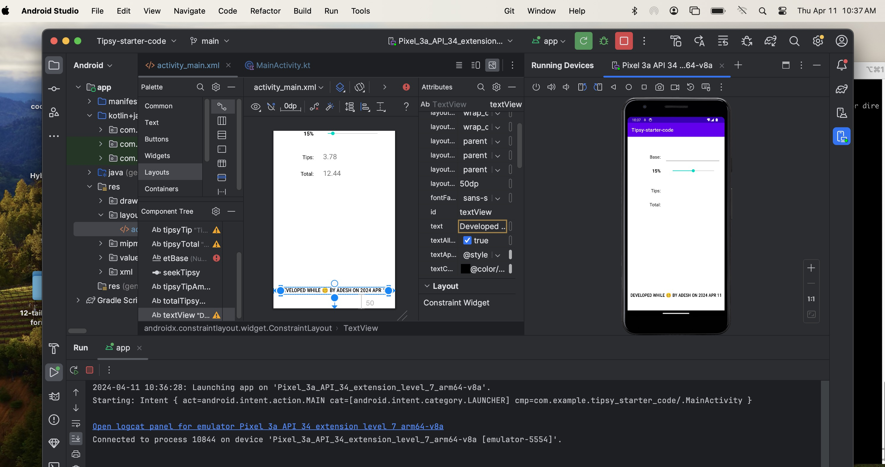
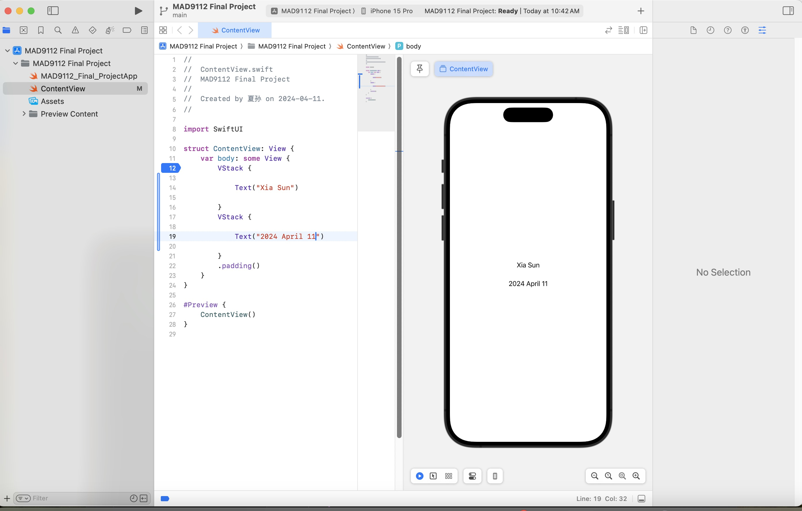
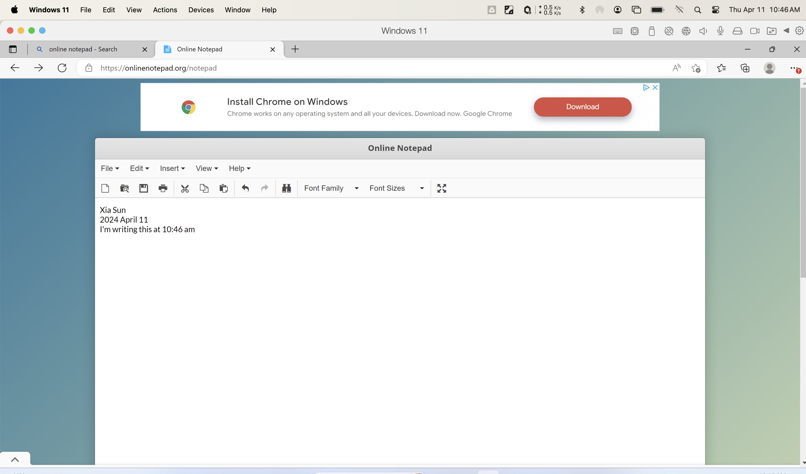

# Xia Sun sun00215

## Topic 2 code block

```javascript
function calculateBMI(weight,height) {
    const result = (weight/height)/1.91
    return result.toFixed(2)
}
const adeshWeight = 90
const adeshHeight = 1.91
const BMI = calculateBMI(adeshWeight, adeshHeight)
console.log(`Adesh's BMI is ${BMI}`);

function interpretBMI(bmi) {
    if (bmi < 18.5) {
        return "Underweight"
    }else if (bmi >= 18.5 && bmi <= 25) {
        return "Normal weight"
    }else if (bmi >= 25 && bmi < 30) {
        return "Overweight"
    }else {
        return "Obese"
    }
}
const interpretation = interpretBMI(BMI)
console.log(`Based on your BMI, which is ${BMI} you are ${interpretation}`);
```

## Images
### screenshot for topic3

### screenshot for topic4

### screenshot for topic5
